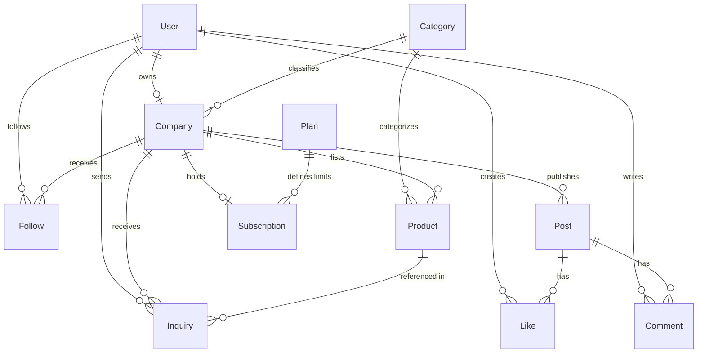

# twintell — Architecture Documentation

This document describes the architectural decisions, database models, request lifecycles, and design patterns for the **twintell** B2B social network and business directory.

---

## 1. System Architecture Diagram

```
                     ┌──────────────────────────────────────────────┐
                     │           Next.js Frontend (Vercel)          │
                     │  - App Router, React 19, Tailwind CSS        │
                     │  - TanStack Query (60s staleTime)            │
                     │  - Supabase JS Client for Auth               │
                     └──────────────────────┬───────────────────────┘
                                            │
                           HTTPS Requests with Bearer Token
                                            │
                                            ▼
                     ┌──────────────────────────────────────────────┐
                     │          Express Backend (Render/AWS)        │
                     │  - Modular Monolith Architecture             │
                     │  - Security: Helmet, CORS, Rate Limiters     │
                     │  - Validation: Zod schemas on all inputs     │
                     │  - Middleware: requireAuth, onlyCompany      │
                     └──────────────┬──────────────────┬────────────┘
                                    │                  │
                Postgres Queries    │                  │  Token Verification &
           (Prisma Pooler port 6543)│                  │  Signed Storage URLs
                                    ▼                  ▼
              ┌───────────────────────────┐      ┌─────────────────────────┐
              │  Supabase Postgres DB     │      │  Supabase Auth &        │
              │  (Mumbai Region)          │      │  Storage (S3 compatible)│
              └───────────────────────────┘      └─────────────────────────┘
```

---

## 2. Modular Monolith Architecture

All backend features are structured into isolated modules inside `backend/src/modules/`:

| Module | Responsibility | Key Endpoints |
|---|---|---|
| `auth` | User profile retrieval, onboarding, profile updates | `GET /api/me`, `PATCH /api/me`, `POST /api/onboarding` |
| `posts` | Feed generation, post creation, likes, comments | `GET /api/feed`, `POST /api/posts`, `POST /api/posts/:id/like` |
| `companies` | Directory listings, company profile, follow system | `GET /api/companies`, `GET /api/companies/:slug`, `POST /api/companies/:id/follow` |
| `products` | Product listings, creation, updates, detail views | `GET /api/products`, `POST /api/products`, `PATCH /api/products/:id` |
| `inquiries` | "Contact Supplier" leads submitted by users | `POST /api/inquiries`, `GET /api/inquiries` |
| `search` | ILIKE search across companies, products, posts | `GET /api/search` |
| `uploads` | Generates signed Supabase storage upload URLs | `POST /api/uploads/sign` |
| `subscriptions` | Checks plan limits dynamically from the database | Middleware: `checkPostLimit`, `checkProductLimit` |

### Module File Conventions
Each module must follow this structure:
- `<feature>.routes.ts`: Express routes with associated middleware chain.
- `<feature>.controller.ts`: Parses HTTP parameters, calls service, sends standard response.
- `<feature>.service.ts`: Core business logic, Prisma transactions, data transformations.
- `<feature>.schema.ts`: Zod validation schemas for request query, params, and body.

---

## 3. Database Schema Overview (Single Source of Truth)

The database runs on Supabase Postgres and is managed via Prisma ORM.

### Entity Relationship Summary


### Critical Database Constraints & Indexes
1. `User.id` maps directly to the Supabase Auth UUID.
2. `Company.slug` is unique and auto-generated from `Company.name`.
3. `Like` has composite primary key `(userId, postId)`.
4. `Follow` has composite primary key `(userId, companyId)`.
5. Cursor indexes exist on `Post(createdAt DESC)`, `Post(companyId, createdAt DESC)`, and `Product(createdAt DESC)`.

---

## 4. Database Connection Strategy

Supabase provides two database connection strings:
- **`DATABASE_URL` (Port 6543)**: Transaction pooler with PgBouncer. Used for standard backend runtime queries.
- **`DIRECT_URL` (Port 5432)**: Direct connection to Postgres. Used by Prisma CLI for migrations (`prisma migrate`).

---

## 5. Subscription Limits Engine (Future-Ready)

Plans are stored in the database (`FREE`, `PRO`, `ENTERPRISE`) rather than hardcoded in the codebase:
- `postsPerMonth`: Maximum posts allowed per billing period (`null` = unlimited).
- `productsLimit`: Maximum active products allowed (`null` = unlimited).
- For Phase 1 / POC, all companies are onboarded with the `FREE` plan (limits set to `null`).
- Middleware `checkPostLimit` and `checkProductLimit` dynamically query the company's active `Subscription` and associated `Plan`. If limits are exceeded, a 403 `PLAN_LIMIT_REACHED` error is returned.

---

## 6. Secure Uploads Flow (Supabase Storage)

To avoid heavy server memory consumption and scale efficiently, file uploads are handled directly between the client browser and Supabase Storage:
1. Browser requests a signed upload URL via `POST /api/uploads/sign` (passing `fileType` and `fileSize`).
2. Backend validates that `fileType` is an image (`image/jpeg`, `image/png`, `image/webp`) and size does not exceed 5MB.
3. Backend calls `supabaseAdmin.storage.from('twintell-uploads').createSignedUploadUrl(filePath)`.
4. Browser directly uploads the file bytes to Supabase Storage via `PUT`.
5. Browser saves the public or permanent storage URL in the post/product creation payload.
